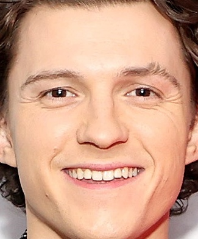
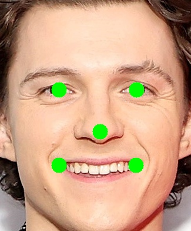
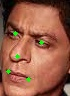
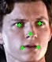
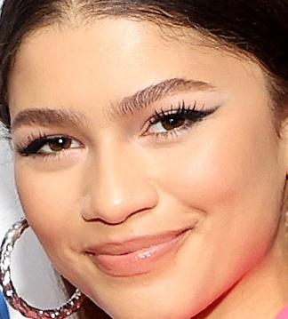
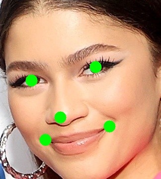

    

## Overview
This repository provides code to run stage 3 (ONet) of the MTCNN (Multi-Task Cascaded Convolutional Networks) model for landmark detection on a cropped face image. These landmarks can then be used for frontal face detection or face alignment.

The MTCNN model is a deep learning-based face detection algorithm that can detect faces in images with high accuracy. It consists of three stages: PNet, RNet, and ONet. The first two stages are used to generate candidate face regions, while the third stage (ONet) is used to refine the candidate regions and detect facial landmarks (left eye, right eye, nose, left mouth centre, right mouth centre) -> see [paper](https://arxiv.org/abs/1604.02878) for more details.

You'll find in the sample results that the model works very well with both high-resolution images as well as low-resolution images. It is a very `lightweight` model and can be easily deployed on either a `CPU` or small `GPU`. The model is also suitable for deployment on `edge/mobile devices`.

## Demo
Here's a demo of the code in this repository in action:
|Input Face|Face Landmarks|---------------|Input Face|Face Landmarks|
|:-:|:-:|:-:|:-:|:-:|
||||||
||||||
||||||
||||||

The above outputs are generated from the script `demo/demo.ipynb`. You can use it to test basic functionality.

## Features
The code in this repository provides the following features:
- Run MTCNN stage 3 (ONet) on a cropped face image
- Generate landmark points for the cropped face
- Generated landmarks can then be used for multiple practical applications like:
  - Frontal face check
  - Face alignment

## Requirements
To use the code in this repository, you'll need to have the following installed:

- Python 3.x
- TensorFlow 1.x
- NumPy
- OpenCV

You can install the required Python packages by running the following command:
```bash
pip install -r requirements.txt
```

## Usage
To run the code, follow these steps:
1. Import the `FaceLandmarkModel` class from the `landmark_model` module:
   ```python
   from landmark_model import FaceLandmarkModel
   ```
2. Initialize the `FaceLandmarkModel` class with the path to the ONet model file:
    ```python
    model = FaceLandmarkModel(model_path='landmark_detector_weights.npy')
    ```
3. Call the `face_landmarks` method of the `FaceLandmarkModel` class to generate landmark points for a cropped face image:
    ```python
    landmarks = model.face_landmarks(cropped_face_image)
    ```

Here's an example of how to use the code to facial landmarks in an image:
```python
import cv2
from landmark_model import FaceLandmarkModel

# Load the input image
image = cv2.imread('cropped_face_image.jpg')

# Initialize the MTCNN model with the given model path
model_path = 'landmark_detector_weights.npy'
face_landmark_model = FaceLandmarkModel(model_path)

# Check if the input image contains a face and detect the landmarks
score, landmarks = model_path.face_landmarks(image)

if score > 0.95:
    print('The input image contains a face with landmarks: ', landmarks)
else:
    print('The input image does not contain a clear face.')
```

Note that you'll need to have the `OpenCV` library installed to load the input image, and you'll need to have the `landmark_detector_weights.npy` file (which contains the pre-trained ONet model) in the same directory as your Python script.

### *Original Paper*

["Joint Face Detection and Alignment using Multi-task Cascaded Convolutional Networks", Kaipeng Zhang](https://arxiv.org/abs/1604.02878)
[](https://doi.org/10.48550/arXiv.1604.02878)

Definitely worth a read!

### Questions, Concerns, Bugs

PS. There are multiple use-cases where this model can be used. I have only mentioned a few. `Feel free to explore more or reach out incase you need help with any project`.

Anyone is welcome to report and/or fix any bugs. I will resolve any open issues as soon as possible.

Any questions about the implementation, no matter how simple, are welcome. I will patiently explain my code to you.

Thanks to [Kaipeng Zhang](https://github.com/kpzhang93/MTCNN_face_detection_alignment) and [David Sandberg](https://github.com/davidsandberg/facenet) for the Tensorflow implementation which helped inspire this project.
